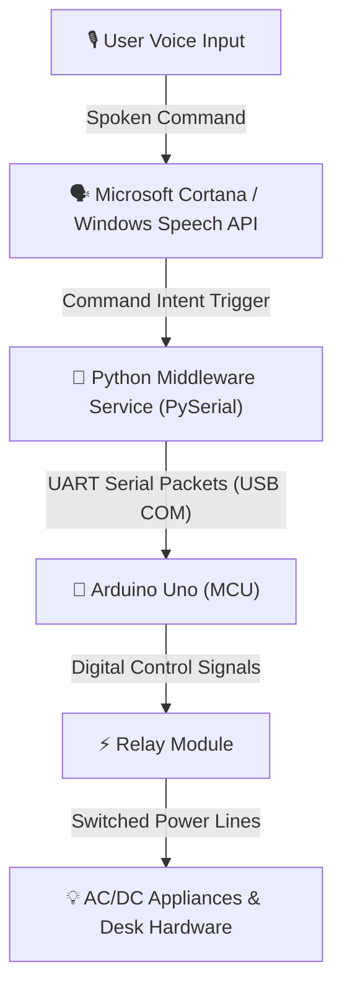

# Voice-Controlled Home Automation Interface (Cortana Integration)

**Project Duration:** Mar 2020 – May 2020

[](https://www.arduino.cc/)
[](https://www.python.org/)
[](https://github.com/)
[](https://github.com/)

An end-to-end voice-activated desktop and appliance automation pipeline engineered during the 2020 lockdown to bridge Microsoft Cortana voice commands with physical hardware actuators and desktop system routines via serial communication.

---

## 📽️ Video Demonstration

*Demo video link or media demo placeholder (update URL if published to YouTube).*

---

## ⚠️ Challenges & Engineering Solutions

### 1. Cortana Sandbox & Direct Hardware Access Restrictions
* **The Problem:** Microsoft Cortana natively runs in a sandboxed Windows environment without built-in capabilities to send raw serial commands over COM ports to microcontrollers.
* **The Solution:** Implemented an intermediary Python background listener script that hooked into system speech recognition and batch command triggers. When Cortana executed predefined local voice intents, the script intercepted the trigger and transmitted serialized binary packets over PySerial to the target microcontroller.

### 2. False Triggering & Background Audio Interference
* **The Problem:** Ambient noise and PC audio playback caused false positive voice command activations, toggling relays unintentionally.
* **The Solution:** Added structured keyword parsing and confidence threshold checks in the voice interface pipeline, requiring explicit wake phrases and state confirmations before dispatching actuation payloads.

### 3. Serial Port Contention & COM Port Locking
* **The Problem:** Simultaneous calls from multiple automation scripts resulted in serial resource collisions and locked COM ports, causing connection failures to the Arduino.
* **The Solution:** Built a singleton serial manager in Python with automated port detection, connection retries, and non-blocking packet dispatching to ensure thread-safe hardware communication.

---

## 🌟 Technical Highlights

* **Voice User Interface (VUI):** Hands-free natural speech control for indoor room illumination, peripherals, and custom desktop workflow macros.
* **Serial Bridge Infrastructure:** Low-latency PySerial UART communication layer linking Windows OS speech APIs with 8-bit AVR microcontrollers.
* **Relay Load Actuation:** Digital switching of household appliances and peripheral loads through multi-channel relay modules with optical isolation.
* **Lockdown Prototyping:** Rapid hardware design and code architecture developed entirely with locally available bench components during the 2020 quarantine period.

---

## 📐 System Architecture



---

## 🛠️ Hardware Bill of Materials (BOM)

| Component | Description | Function |
| --- | --- | --- |
| **Arduino Uno** | ATmega328P Microcontroller Board | Low-level command parsing and relay driver logic |
| **Optocoupled Relay Module** | 5V Relay Board (1-Channel / 4-Channel) | Physical load switching for lights and desk accessories |
| **Host PC (Windows 10)** | Local workstation | Audio sampling, Cortana voice engine, and Python host |
| **USB Type-A to Type-B Cable** | High-speed USB serial link | Bi-directional UART data communication and MCU logic power |
| **Connecting Jumper Wires** | Breadboard wiring | Signal distribution between Arduino and relay module |

---

## 🔌 Pinout Mapping

| Arduino Uno Pin | Peripheral Connection | Signal Description |
| --- | --- | --- |
| `D2` | Relay Module `IN1` | Primary Appliance / Desk Light Toggle |
| `D3` | Relay Module `IN2` | Secondary Appliance / Auxiliary Toggle |
| `5V` | Relay Module `VCC` | 5V DC Logic Supply |
| `GND` | Relay Module `GND` | Common Ground Reference |
| `USB (COM)` | Windows Host PC | PySerial UART Interface (9600 Baud) |

---

## 🚀 Getting Started

### 1. Prerequisites

* Windows 10 with Cortana / Windows Speech Recognition enabled.
* Python 3.8+ with `pyserial`:
```bash
pip install pyserial

```


* [Arduino IDE](https://www.arduino.cc/en/software) (version 1.8.x or 2.x).

### 2. Flashing the Microcontroller

1. Clone the repository:
```bash
git clone [https://github.com/](https://github.com/)<your-username>/cortana-voice-home-automation.git
cd cortana-voice-home-automation

```


2. Open `firmware/voice_relay_controller.ino` in the Arduino IDE.
3. Select board `Arduino Uno` and the corresponding COM port.
4. Click **Upload**.

### 3. Running the Host Middleware

1. Update the COM port identifier in `scripts/serial_listener.py`:
```python
SERIAL_PORT = "COM3"  # Adjust to your Arduino COM port
BAUD_RATE = 9600

```


2. Start the serial listener service:
```bash
python scripts/serial_listener.py

```


3. Issue configured voice commands to Cortana to trigger desk appliances hands-free.

```

```
